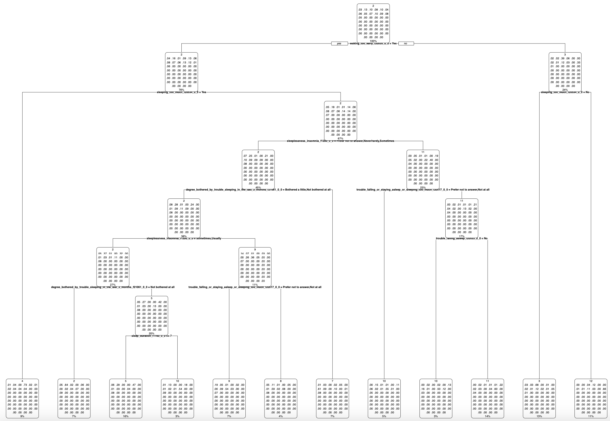
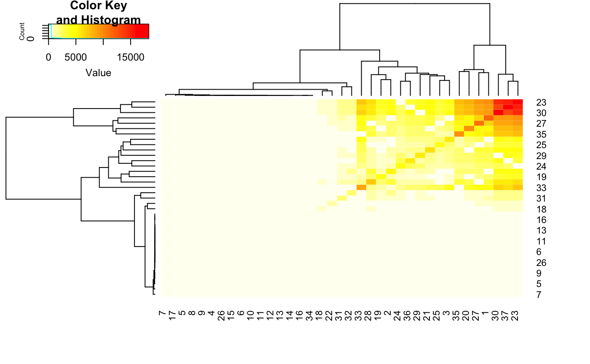

```{r setup, include=FALSE}
knitr::opts_chunk$set(echo = FALSE)
```

```{r}
library(dplyr)
library(tidyverse)
library(cluster)
library(ggplot2)
library(factoextra)
library(tree)
library(janitor)
library(randomForest)
library(randomForestSRC)
library(fastDummies)
library(igraph)
library(tidygraph)
library(rpart)
library(rpart.plot)
library(tidyr)
library(DT)
```

```{r}
df <- tibble(readRDS("data/ukbiobank.rds"))
vt <- read.csv("data/variable_table.csv")
```

### Baseline sleep variables
```{r}
var_name <- vt[vt$instance == 0 & vt$category == "Sleep", "variable"] %>% na.omit()
var_name
```

## Louvain Clustering  

The Louvain method is an unsupervised algorithm to detect communities in large networks. It does not require the input of the number of communities nor their sizes before execution. It maximizes a modularity score for each community, where the modularity quantifies the quality of an assignment of nodes to communities. This means evaluating how much more densely connected the nodes within a community are, compared to how connected they would be in a random network.    

The Louvain algorithm is a hierarchical clustering algorithm, that recursively merges communities into a single node and executes the modularity clustering on the condensed graphs.     

Source: https://neo4j.com/docs/graph-data-science/current/algorithms/louvain/    
https://towardsdatascience.com/louvain-algorithm-93fde589f58c

```{r}
var_name <- c("eid", var_name)
x <- df[, var_name]
x_df <- x %>% na.omit()
```

```{r}
rf.fit <- randomForest(x = select(x_df, -eid), y = NULL, ntree = 10, proximity = TRUE, oob.prox = TRUE)
```

```{r}
g = graph_from_adjacency_matrix(rf.fit$proximity, weighted = TRUE, mode = "undirected") |>
  as_tbl_graph()
cl = cluster_louvain(g)
x_df$louvain = cl$membership
```

```{r}
# x_df |> select(c("eid", "louvain")) |> 
#   saveRDS("data/sleep_profile.rds")
```

### Clustering Results

Participants within the same cluster can be regarded as people with similar sleeping conditions.

```{r}
profile_table <- x_df$louvain |> 
  table() |>
  as.data.frame()

profile_table <- profile_table[order(-profile_table$Freq), ]
colnames(profile_table) <- c("Cluster Number", "Frequency")
rownames(profile_table) <- NULL

datatable(profile_table, options = list(scrollX = TRUE))
```

```{r}
keep_clus = x_df$louvain |> 
  table() |> 
  sort(decreasing = TRUE) |> 
  head(46) |>
  names() |>
  as.integer()

xfr = x_df |>
  filter(louvain %in% keep_clus) 

rpf = rpart(
  factor(louvain) ~ ., 
  data = xfr |> select(-eid))

file_path = "assets/sleep_clustering/clustering_tree.pdf"
# pdf(file = file_path)
# rpart.plot(rpf)
# dev.off()
```

### Clustering Treemap
```{r, echo=FALSE}

```

### Significant Variables in Clustering
```{r}
cols_hm <- c("waking_too_early_f20535_0_0", 
             "sleeping_too_much_f20534_0_0",
             "sleeplessness_insomnia_f1200_0_0",
             "degree_bothered_by_trouble_sleeping_in_the_last_3_months_f21061_0_0",
             "trouble_falling_or_staying_asleep_or_sleeping_too_much_f20517_0_0",
             "trouble_falling_asleep_f20533_0_0",
             "sleep_duration_f1160_0_0")
cols_hm
```

```{r}
x_hm <- x_df[, c("eid", cols_hm)]
x_hm <- reshape2::melt(data = x_hm, id.vars="eid", variable.name = "sleep_var", value.name="sleep_val")
x_hm$med <- apply(x_hm[,2:3], 1, paste0, collapse="_")
```

```{r}
xw <- reshape2::dcast(x_hm, eid ~ med, fun.aggregate = length)
xwm <- as.matrix(xw[,-1])
xc <- t(xwm) %*% xwm
```

```{r}
map_len <- length(colnames(xw)[-1])
```

```{r}
colnames(xc) <- c(1:map_len)
rownames(xc) <- c(1:map_len)
```

```{r}
# gplots::heatmap.2(xc, trace="none", col = rev(heat.colors(map_len)))
```

### Heatmap
All the significant variables in sleep clustering are correlated. As the objective of clustering is to group data points based on similar sleeping patterns, the correlation between sleeping variables may actually be meaningful for the analysis. We can further interpret the results to generate a sleep profile for each participant.

```{r, echo=FALSE}

```

```{r}
colnames(xw)[-1]
```


